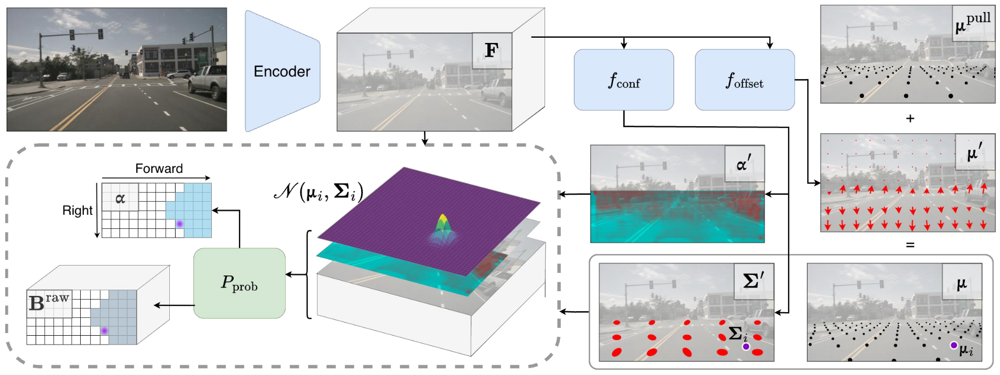

<div align="center">
<h2 align="center"> Mapping like a Skeptic: <br/> Probabilistic BEV Projection for Online HD Mapping </h1>

<h4 align="center"> BMVC 2025 </h4>

[Fatih Erdoğan<sup>1</sup>](https://fatih-erdogan.github.io/) , 
[Merve Rabia Barın<sup>1,2</sup>](https://mrabiabrn.github.io/) , 
[Fatma Güney<sup>1,2</sup>](https://mysite.ku.edu.tr/fguney/)

<sup>1</sup> Koç University  &nbsp;&nbsp; <sup>2</sup> KUIS AI Center

<br/>

[](https://arxiv.org/abs/2508.21689)

<br/><br/>



<br/><br/>

</div>


## Table of Contents
- [Introduction](#introduction)
- [Installation](#installation)
- [Data preparation](#data-preparation)
- [Getting Started](#getting-started)
- [Acknowledgements](#acknowledgements)
- [Citation](#citation)
- [License](#license)

## Introduction

This repository provides the official implementation of the paper [Mapping like a Skeptic: Probabilistic BEV Projection for Online HD Mapping](https://arxiv.org/abs/2508.21689).


## Installation

Please refer to the [installation guide](docs/installation.md) to set up the environment.


## Data preparation

Instructions for data preparation and downloading our checkpoints are available at [data preparation guide](docs/data_preparation.md). 


## Getting Started

Instructions on how to run training, inference, evaluation, and visualization: [getting started guide](docs/getting_started.md).


## Acknowledgements

This repository is built upon [MapTracker](https://github.com/woodfrog/maptracker). Our contributions are in the BEV module, while the vector module is borrowed from the original MapTracker implementation.

We thank the authors of [MapTracker](https://github.com/woodfrog/maptracker), [StreamMapNet](https://github.com/yuantianyuan01/StreamMapNet), and [MapTR](https://github.com/hustvl/MapTR) for their progressive contributions to online HD mapping.


## Citation

If you find our paper and methods useful in your research, please consider citing:

```
@inproceedings{erdogan2025mapping_like_skeptic,
  author    = {Erdogan, Fatih and Barin, Merve Rabia and Guney, Fatma},
  title     = {Mapping Like a Skeptic: Probabilistic BEV Projection for Online HD Mapping},
  booktitle = {Proceedings of the British Machine Vision Conference (BMVC)},
  year      = {2025},
  note      = {To appear; arXiv:2508.21689}
}
```

## License

This project is licensed under GPL, see the [license file](LICENSE) for details.
